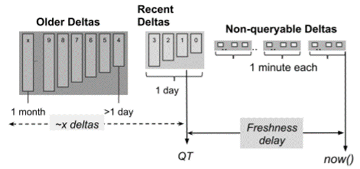
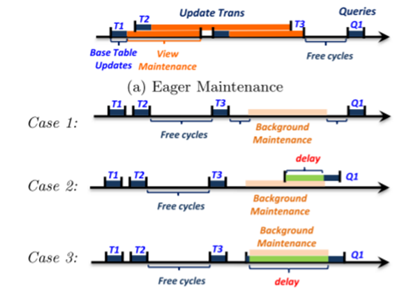
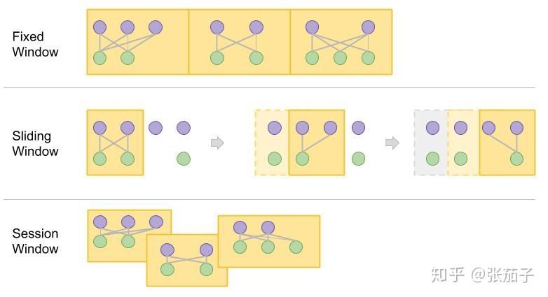
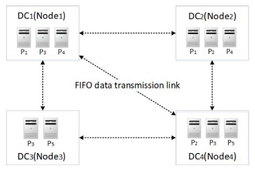
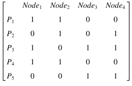

### 数据一致性知识点

数据一致性分为强一致性、弱一致性和因果一致性。

强一致性要求任何数据更新在所有副本中立即可见；弱一致性不要求数据更新在所有副本中立即可见，它通过使用一定的规则使所有副本在一定时间内保持相同的状态。根据对分布式环境的分析和CAP定理（即在分布式系统中，一致性、可用性和分区容忍度最多只能有两个条件），强一致性导致高延迟和对网络分区的零容忍，弱一致性导致短时间内数据不一致，从而导致应用异常。

因果一致性协议是介于强一致性和弱一致性之间的协议，能够有效解决强一致性带来的高延迟和零分区容忍问题，避免弱一致性带来的应用异常。它满足了分布式环境和CAP定理的要求。因果一致性以其独特的优势在分布式存储系统的构建中得到了广泛的应用。

---

### 《Napa: powering scalable data warehousing with robust query performance at Google》

 Ankur等学者（引文：Ankur Agiwal, Kevin Lai, Indrajit Roy,et al. 2021. Napa: powering scalable data warehousing with robust query performance at Google. Proc. VLDB Endow. 14, 12 (July 2021), 2986–2997.）由于Google服务不断生成大量数据，同时需要在可扩展性、亚秒级查询响应时间、可用性和强一致性的条件下存储和服务这些数据集的挑战下，开发部署了了一个分析数据管理系统Napa。Napa相比Mesa，Napa使用物化视图取代了Mesa繁琐的刷新技术来加速分析型查询；Napa将数据新鲜度、成本和查询性能三者根据客户需求进行调整，使需求转换为内部数据库配置，并引入可查询时间戳（Queryable Timestamp，QT）。使用QT判断物化视图的延迟度，如图所示，

QT之前为可查询时间，QT到Now（）之间的内容无法查询，[Now（）-QT]代表增量的数据新鲜度。如果QT（table）= X，则客户端可以查询在时间X之前摄取到表中的所有数据，QT充当屏障，在X之后接收的任何数据都对客户端查询隐藏。一旦在（Y-X）范围内接收的数据被优化以满足查询性能要求，QT的值将从X前进到Y。QT在读时使用最小值作为读的时间点，数据库的QT是数据库所有表QT值的最小值。

例子：本地QT值为100、90、83、75、64的5个Napa副本，并且查询服务要求大多数副本可用，则跨所有站点的新QT被设置为83，因为大多数副本至少到83为止是最新的。Napa将使用QT至少为83的副本来回答查询，因为可以保证对这些副本的查询只需要读取本地可用的增量。

对于提高查询性能，Napa通过三种技术实现：（1）通过更积极地使用视图，（2）通过改变存储策略，Napa在存储层提前合并增量，减少查询时增量的数量，并因此减少尾部等待时间，（3）通过解耦摄取、视图维护和查询执行。数据操作在数据中心的每个副本异步执行，而元数据操作定期执行，确保副本之间的数据可用性。Napa直接使用F1作为执行引擎。

-------------------------------------------------------------------------------------------------------------------------------------------------------------------------------------------

### 《Lazy maintenance of materialized views》

数据库系统通常在基表更新的同一事务中急切地维护视图，这使得视图维护开销很大，Zhou等学者（引文：Jingren Zhou, Per-Ake Larson, and Hicham G. Elmongui. 2007. Lazy maintenance of materialized views. In Proceedings of the 33rd international conference on Very large data bases (VLDB '07). VLDB Endowment, 231–242.）提出了一种新的惰性维护物化视图的方法，既能减轻视图维护的负担，也能保证查询到最新的视图。惰性维护基本原则：（1）基表更新时，系统不维护视图，只是存储增量信息；（2）系统有空闲周期时，维护由低优先级作业执行；（3）视图在查询时不是最新的，在允许查询访问它之前，该视图被立即维护更新，但仅维护该视图。

如图所示，图中显示惰性视图维护的整体系统设计。

增量表：存储基表的增量流，表中每行有两个附加列（事务序列号和语句序列号）表示哪些事务和语句生成了该增量行。

维护管理器：跟踪维护任务以及生成维护任务并调度，周期性地创建低优先级作业，删除增量表中过时的增量。管理器中包含一个哈希表，以快速寻找给定视图的所有维护任务。

 任务表：存储和删除维护任务，仅用于恢复，不做正常处理。

维护任务：由需要维护的视图信息、更新的基表信息、事务序列号、语句序列号、原始事务提交序列号和任务当前状态组成。事务序列号和语句序列号用于惰性维护时定位增量行和基表版本，原始事务提交序列号确定任务维护顺序，任务当前状态用于维护管理器计划和跟踪任务。

当查询开始之前，管理器检查计划使用的视图是否有挂起的维护任务（确保需要使用的视图都是最新的），若存在维护任务，管理器将立即执行这些任务，同时基表上所有的索引立即更新，任务完成后，查询继续执行。如果挂起的维护任务不影响查询访问的视图，则该视图不必立即更新。

图为惰性维护和紧急维护在响应时间上的比较。

a、基表更新便立即更新视图，当查询到达时，更新已经全部完成，视图内容为最新的，此时，查询立即完成；

b（1）、基表三次更新T1、T2、T3完成后，维护管理器等待系统空闲时，创建低优先级作业完成维护任务，查询到达时，视图是最新的，查询快速完成，查询响应时间与a相同；

b（2）、基表完成更新后，视图进行维护时，查询到达，查询等待维护任务完成后继续执行；

b（3）、基表更新完成，查询在系统维护视图之前到达，查询在开始时发出按需维护请求，并等待维护完成，查询继续执行。

-------------------------------------------------------------------------------------------------------------------------------------------------------------------------------------------

### 知识点：流处理系统

（[Stream SQL 的执行原理与 Flink 的实现 - 知乎 (zhihu.com)](https://zhuanlan.zhihu.com/p/59643962)）

**流(Stream)**可以被看作一种无界(Unbounded)且只可追加的(Append-Only)的数据表。

**流处理系统的时间操作**

在现实世界的分布式系统当中处理流主要面对的问题有：

1. 绝对时钟(Absolute Clock)问题：现实世界当中的时钟往往不精确，而且在分布式系统当中实现时间绝对同步是(物理上)不可能的；
2. 时间倾斜(Time Skew)问题：由于系统中必然会存在网络延迟、网络中断和系统崩溃等问题， 发送到系统的消息和系统内部的消息很可能失序乃至丢失。

**解决方案**

   1.对于第一个问题，现代操作系统普遍使用事件驱动(Event-Driven)模型来处理。通过使用消息本身携带的生成时间(Event-Time) 而不是系统接收到消息的时间(Processing Time)来进行处理。这样的系统当中，时钟是由事件来驱动的。 没有新的事件到来，系统的状态就如同冻结起来了一样。

**激发器(Trigger)**是一类特别的事件，当这种事件的消息被接收到时，某些任务会被激发和执行。

**水印(Watermark)**简单来说，就是根据消息的事件时间来决定一条消息应该被处理还是被丢弃的标记。

上图中，从右到左是消息到达的时间，在某时刻，消息8通过激发器激发了一次对水印的修改。此时水印的时间限制被修改为 4 。 这意味着之后到达的标号时间小于4 的消息都会被丢弃。在消息 8 之后到达的消息 7 和 5，虽然时间戳比消息 8 要早， 但是因为仍在 Watermark 的范围里，因此会被考虑在内。最后到达的消息有时间标号 9，他是一条当前观察到过的消息之后的消息， 因此也会被处理。

水印的规则：

1. 水印应该永远小于当前处理过的事件的时间戳；
2. 水印是通过激发器的激发来移动的，算子可以自己决定移动水印的时间，而不是每个接收到的事件都会改变水印；
3. 水印必须是单调递增的。否则，一旦水印向前移动，我们无法知道是否已经有被包含在水印范围里的消息被丢弃。

**窗口(Window)**是一种设计出来让用户更好地描述它们对时间的需求的工具。 他可以让用户在一个窗口里以有限时间/数据范围的方式操作数据，同时也为进一步优化时间空间成本提供了可能。

流处理系统提供的常见的窗口类型有：

1. 固定窗口(Fixed Window)：长度固定的窗口，每个窗口一个紧跟着一个，将时间维度划分成片段；
2. 滑动窗口(Sliding Window)：长度固定，但每个窗口的开始时间相比于前一个窗口都有一个固定的时间偏移；
3. 会话窗口(Session Window)：使用事件的属性和相互的时间间隔把他们组织在一个窗口里。这些窗口的开始时间、 持续长度等都会变化。这类窗口用于用户追踪、线索跟踪等场景十分有效。

**窗口和水印是两个不同的概念。**一个窗口的结束时间已经过去， 并不意味着这个窗口不能再接收迟到的落入这个窗口的消息。实际上，这个窗口的内部状态可以被一直保存， 以便于在接收到新的消息之后刷新窗口内容并输出增量表。一个窗口及其内部状态将只会在水印完全通过之后被回收。 事实上，一个窗口的打开和关闭都有赖于激发器的作用。

**句点(Punctation)**是一些在窗口关闭之前激发的激发器，它使得窗口可以输出它的中间结果而不必等到整个窗口的消息都处理完成。这对于提供低延迟数据传达十分有用。

**Stream Join 的语义**

由于 Stream 都是无边界的数据，传统数据表当中的 Join 概念在流处理系统当中可能不完全适用。 流处理系统当中的 Join 往往有以下几种类别和语义：

1. Stream 与纯静态表 Join。这里的纯静态表的内容不会改变，因此 Join 的实现只是在 Stream 端对每个消息在静态表内进行查询；
2. Stream 与动态表的快照 Join。动态表的内容可能会出现增删改等情况，这里的 Join 的语义是， 当对流当中的某个消息实施 Join ，相当于查询了动态表在那一时刻的快照；
3. Stream 与 Stream Join，操作的两边都是 Stream。

**动态表与Stream Join** 则是通过将动态表处理成类似 MVCC 并发控制那样的形式， 因此在每一个来自于 Stream 的消息需要 Join 时，只需要查询对应**事件时间**下动态表的快照即可。 

在 Stream Join 动态表这个模型中，动态表这端虽然可能也是由 Stream 而来，但是对动态表的插入和修改操作(也表示称 Stream 消息)并不会激发 Join 结果的刷新。 这些消息只是被加入到内部状态中，等待 Stream 里的消息激发刷新时查询。 这是动态表 Join Stream 与Stream Join Stream 最大的区别。

Stream 与 Stream Join 在两边有消息来的时候都有可能激发大量查询和修改操作，因此面临着严峻的查询放大放大和修改放大问题。在流式处理系统中，一种解决方法是结合窗口语义实现局部的 Join，下图描述了不同窗口下 Join 的语义。

------

### 《Watermarks in Stream Processing Systems: Semantics and Comparative Analysis of Apache Flink and Google Cloud Dataflow 》

**准备就绪**：对于流处理，准备就绪是指具有可用于产生某个输出的所有必要输入的状态。

**健康监测**：由于水位线跟踪整个数据处理管道的进度，因此影响管道进度的任何问题都将表现为水位线中的延迟。假设流处理框架提供了水印的足够细粒度的视图（例如，在管道中的物理阶段之间和内部进行划分），则通常可以通过查找第一个延迟水印来精确定位管道中的问题。

------

### 《Convergent Causal Consistency for Social Media Posts 》

异地复制服务在云存储管理中发挥着至关重要的作用，它可以提供增强的可用性、更高的可靠性和更低的延迟，从而按需访问共享基础架构和数据资源。在这样的环境中，一致性对于其中需要对复制的数据进行更新的分布式存储系统是关键的和基本的考虑。收敛因果一致性模型为在线人机交互服务提供了有用的语义，已成为一种流行的一致性模型。自适应非完全复制策略具有降低社交网络系统中消息计数的潜在好处。但是，静态复制对于随时间变化的工作负载效率不高。提出了一个因果+一致性协议CaDRoP，支持自适应动态复制，该协议对帖子后的所有评论具有收敛性，并支持帖子之间的因果排序。根据Amazon Web Service的实际价格，采用不同的PUT率对CaDRoP协议在实际工作负载下进行了评估。结果表明，与在静态复制的数据存储中运行相比，CaDRoP可以产生明显更低的成本。我们通过将其与透视最优复制解决方案进行比较来进一步评估CaDRoP。研究结果表明，使用缓存时，CaDRoP只会产生大约6% 〜 16%的额外成本。没有缓存，CaDRoP在稳定状态下会带来2% 〜 4.5%的额外开销。

------

### 《Fine-grained Distributed Consistency Guarantees with Effect Orchestration 》

高可用性的分布式应用程序通常需要在地理上分布的存储上复制数据，而这些存储在默认情况下提供的一致性保证较弱。不幸的是，在弱一致性下可能出现不期望的行为，这可能违反应用程序的正确性，迫使设计人员要么实现复杂的特别机制来避免这些异常，要么通过牺牲性能来选择使用更高级别的一致性来运行应用程序。在本文中，我们描述了一个轻量级的运行时系统，它使开发人员不必进行这样的权衡。相反，我们的方法利用了声明性公理规范，这些规范反映了任何正确的实现都必须满足的必要约束，以指导运行时一致性实施和监视机制。实验结果表明，本文提出的细粒度一致性实施机制的性能（可证明是最优的和安全的）优于普通存储提供的一致性保证。

------

### 《Simba: Tunable End-to-End Data Consistency for Mobile Apps 》

云连接移动的应用程序的开发人员需要确保跨多个设备的应用程序和用户数据的一致性。移动的应用程序在各种使用场景下需要不同的分布式数据一致性选择。应用程序还需要优雅地处理间歇性连接和断开、有限的带宽以及客户端和服务器故障。应用程序的数据模型也可能很复杂，跨越相互依赖的结构化和非结构化数据，需要在本地、云和其他移动的设备上以原子方式存储和更新。

在本文中，我们研究了几个流行的应用程序，发现许多应用程序在并发使用时由于数据一致性处理不当而表现出不良行为。针对这些缺点，我们提出了一种新的数据抽象，称为sTable，它统一了表格和对象数据模型，并允许应用程序从一组分布式一致性方案中进行选择;写入此抽象的移动的应用程序可以毫不费力地与云和其他移动设备同步数据，同时受益于端到端数据一致性。我们构建了Simba（一个数据同步服务）来演示我们提出的抽象的实用性，并通过编写新应用程序和移植不一致的应用程序来对其进行评估。实验结果表明，Simba在同步延迟、带宽消耗、服务器吞吐量以及用户数和数据量的伸缩性方面表现良好。

------

### 《ViewDF: Declarative incremental view maintenance for streaming data 》

我们提供ViewDF：用于物化视图的增量维护的灵活且声明性的框架。该框架的主要组成部分是视图增量函数（ViewDF），它声明性地指定当新的一批数据到达时如何更新物化视图。我们描述并实验评估了一个基于该思想的原型系统，该系统允许用户直接编写ViewDF，并自动将常见的流查询类转换为ViewDF。我们的方法概括了增量视图维护的现有工作，并支持流分析中常见的视图的新优化，包括具有模式匹配和滑动窗口的视图。

------

### 《Multidirectional Replication for Supporting Strong Consistency, Low Latency, and High Throughput 》

许多复制协议可以用在各种分布式应用中，例如分布式数据库、协作应用和分布式议程，它们牺牲了强一致性以实现更低的延迟和更高的吞吐量。本文描述了单向复制和多向复制的设计、规范、实现和评估，它们挑战了这种不灵活的折衷。通过并行传播结果状态（如在主备份复制中），但使用较少的消息，同时具有处理写请求的头部和处理读请求的尾部（如在链复制中），单向复制改善了两个协议的延迟和吞吐量，而不损害强一致性。为了提高单向复制的计算和通信资源的利用率，多向复制将对象划分为多个逻辑碎片，并在每个逻辑碎片上运行一个单向复制实例。我们已经通过三个步骤完成了提议的协议：（1）将主备复制和链式复制合并为单向复制;（2）将单向复制和逻辑分片合并为多向复制;（3）实施与评价。实验结果表明，与主备复制相比，单向复制在处理具有读写冲突的读请求时，延迟大约降低了66%;与链式复制相比，当使用基本设置处理写请求时，单向复制在吞吐量方面显示出大约59%的改进;与单向复制相比，多向复制在可处理的客户端数量方面提高了150%。

------

### 《PGCE: A distributed storage causal consistency model based on partial geo-replication and cloud-edge collaboration architecture 》

目前的因果一致性模型难以应对云存储系统中的高同步开销和响应延迟。提出了一种基于部分地理复制和云边缘协作结构的分布式存储因果一致性模型。该模型基于Cloud-Edge协作的分布式网络架构，通过哈希函数将云数据集划分为多个子集，并将这些子集存储在靠近用户网络的边缘节点上，实现局部异地复制。同时，通过建立时间戳稳定机制和元数据处理服务，在保证因果关系的前提下实现节点间的数据一致性，降低了元数据处理和数据同步的开销。客户端直接与边缘节点交互，减少了与云DC交互的响应延迟。与现有模型相比，PGCE在响应延迟和吞吐量方面具有更好的性能。

PGCE的云端可以与已有的因果一致性模式相结合，边缘端的每个节点存储云数据集的一个子集，实现部分地理复制。通过使用副本数据定位矩阵，数据更新仅传播到存储相同数据的节点，从而减少了元数据处理和数据同步开销。客户端的数据请求可以在边缘节点得到及时的处理和响应，减少了直接与云DC进行数据交互所带来的延迟。同时，将稳定状态下的数据定期传输到云端进行全局数据的更新和同步。

图为PGCE基于云边缘协作存储架构设计。Cloud存储客户端写入的所有数据，Edge由大量靠近用户网络的边缘节点组成，采用部分复制策略存储云数据集的子集，根据节点或DC间的存储关系构建点对点FIFO数据同步链路。同时，在边缘端设置时间戳稳定机制和元数据处理节点，为客户端提供因果一致的数据存储和查询服务。客户端由许多终端用户组成，可以通过Migrate操作（当我们读取的键没有存储在本地节点上时：首先，利用Hash函数找到与关键字对应的目标分区。其次，通过矩阵存储关系找到目标分区所在的节点，执行客户端迁移连接到目标节点，实现对非本地节点的数据阅读。）连接到其他边缘节点上，访问本地节点上没有存储的数据。

PGCE建立了时间戳稳定机制和Saturn 元数据服务来跟踪因果一致性。在每个Edge-side中设置一个Saturn节点（元数据处理服务器）。Saturn节点接收所有需要更新或写入的元数据，并调用Saturn接口服务来执行全局因果关系排序，代替在每个边缘节点执行的依赖性检查工作，并以较低的开销确保PGCE的因果关系一致性。

例子：PGCE利用矩阵来描述边缘节点和分区（DC)之间的存储关系。矩阵的行表示分区，列表示节点，元素1表示存储该分区的节点，元素0表示不存储该分区的节点。从矩阵可以看出，当P1被更新时，我们仅将同步消息传播到Node1和Node2，而不传播到Node3和Node4。

基于部分地理复制，每个数据中心存储完整数据集的一个子集，减少了完全地理复制系统的存储、同步和元数据处理开销。

<u>基于因果一致性的分布式存储系统，通过**地理复制策略**实现分布在不同位置的DC之间的数据同步。地域复制策略主要分为两类：完全异地复制和部分异地复制。在完全异地复制场景中，数据更新需要同步到所有副本，随着数据中心数量的增长，数据同步开销巨大。在部分异地复制方案中，数据更新不需要与所有副本同步，从而减少了同步开销，但这会迫使站点增加远程存储数据项的元数据管理成本。</u>

<u>**边缘计算**是指在靠近事物或数据源头的一侧集成网络、计算、存储、应用等核心能力的开放平台，就近提供服务。它具有低延迟、低宽带操作和隐私保护的优势，这不仅降低了云的负载，还满足了边缘客户端的需求，提供了更好的用户体验。**云计算适用于全局性、非实时性、长周期的大数据处理和分析**。**边缘计算具有实时性、数据安全性和隐私保护等优点，适合于实时、短周期的数据处理和分析**</u>

------

### 《Replicated data types that unify eventual consistency and observable atomic consistency 》

强一致性广泛应用于关系数据库等系统中。在分布式系统中，强一致性确保所有客户机在所有服务器上原子地观察一致的数据更新。然而，当同步发生时，这样的系统需要牺牲可用性。

我们提出了一个新的一致性协议，可观察原子一致性协议（OACP），使写主导的应用程序尽可能快和一致的需要。OACP结合了以下优点：（1）可合并的数据类型，具体地说，收敛的复制数据类型，以减少同步，以及（2）可靠的总顺序广播，以提供按需的强一致性。我们还提供了一个高级编程接口，以提高分布式编程的效率和正确性。

本文给出了OACP重写逻辑的形式化、机械化模型，并利用模型检测工具Maude验证了OACP的关键正确性。此外，我们还提供了一个基于Akka的OACP原型实现，Akka是一个广泛使用的基于角色的中间件。实验结果表明，与现有的Raft一致性协议相比，OACP协议能够有效降低协调开销。我们的结果还表明，OACP通过可合并的数据类型提高了可用性，并为实现强一致性提供了可接受的延迟，从而允许有原则地放松强一致性以提高性能。

------

### 《Towards the Synthesis of Coherence/Replication Protocols from Consistency Models via Real-Time Orderings 》

本工作集中于具有读写接口的共享存储器系统（例如，分布式数据存储或多处理器）。在这样的系统的核心驻留有负责执行它们的一致性保证的协议。设计一个正确有效地执行一致性的协议是一项非常具有挑战性的任务。我们的总体愿景是自动完成这项任务。在这项工作中，我们通过建立从一致性规范自动推断协议所需的理论基础，朝着这一愿景迈出了一步。具体来说，我们提出了一组数学抽象，称为实时排序（rt排序），用于对协议进行建模。然后我们创建一个从一致性保证到执行保证的最小rt-序的映射。最后，我们非正式地将rt-序与协议实现技术联系起来。因此，rt-排序充当一致性和协议设计之间的中间抽象，其使得能够将一致性保证自动翻译成协议实现。

---

### CRDTs主题

无冲突复制数据类型（Conflict-free replicated data type，CRDTs）广泛应用于工业分布式系统，如Riak 和AntidoteDB 。它们适合于实现高可用性和可伸缩性的复制共享数据，因为它们支持并发更新，并且如果所有副本最终执行所有更新，则它们保证收敛到相同的状态。

两个主要类别的CRDTs:**行动CRDTs**和**基于状态的CRDTs（CvDRT)**。行动CRDTs传播交换副本之间的更新操作。他们需要“完全一次交付”,这就需要可靠的因果广播。基于状态的CRDTs,也叫做CvRDTs,传播整个状态之间的CRDT副本只要更新状态。交换功能是用于合并多个修正CRDT的状态,因此可以发送多次。

---

### 《DeepSqueeze: Deep Semantic Compression for Tabular Data 》

大型数据集的快速扩散,高效的数据压缩比以往变得更加重要。柱状压缩技术(如字典编码,游程编码,增量编码)表格数据已经证明非常有效,但其通常压缩单个列而不考虑潜在的列之间的关系,如函数依赖和相互关系。语义压缩技术,另一方面,是为了利用这种关系只存储必要列的一个子集来推断,但现有方法不能有效地识别复杂的关系所在列的关系。

DeepSqeeze是一个新的语义压缩框架，通过使用自动编码器将元组映射到低维空间，捕获表格数据中分类列和数值列之间的复杂关系。DeepSqeeze还支持数值数据有损压缩的保证误差范围，并与常见的列式压缩格式结合使用。

**通用压缩算法**忽略了数据集的高级语义，只对原始比特进行操作。这些技术分为两类：（1）无损和（2）有损。

无损压缩是可逆的，这意味着原始输入可以从压缩格式完美恢复。无损压缩算法通常通过识别和去除输入数据中的统计冗余来操作。例如，霍夫曼编码[24]用可变长度代码替换符号，将较短的代码分配给更频繁的符号，使得它们需要更少的空间。

